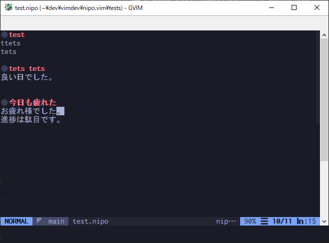

# nipo.vim

vim syntax for nipo.



## Installation

**Using [minpac](https://github.com/k-takata/minpac)**

```vim
" nipo
call minpac#add('zztkm/nipo.vim')
```

Reload `.vimrc` and `:call minpac#update()`.


**Using [vim-plug](https://github.com/junegunn/vim-plug)**

```vim
Plug 'zztkm/nipo.vim'
```

Reload `.vimrc` and `:PlugInstall`.
